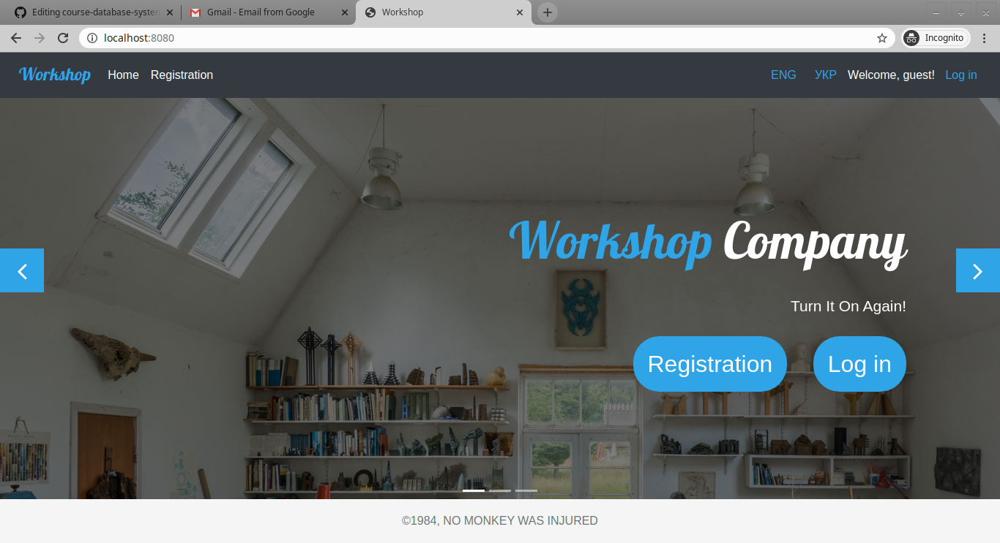

[![Awesome][icon-awesome]][awesome]
&nbsp;&nbsp;&nbsp;&nbsp;&nbsp;&nbsp;

#Workshop  
<div align="center">
	
</div>

## Система **Ремонтне Агентство**  
2. **Користувач** може створювати заявки на ремонт виробу  
3. **Менеджер** може прийняти заявку, вказавши ціну, або відхилити, вказавши причину  
4. **Майстер** може виконати прийняту Менеджером заявку  
5. **Користувач** може залишити відгук про виконані роботи  

### How to install  

1. Clone project  
1. You can use default settings and work with database on zanner.org.ua MySql server or [install and configure MySQL](my-sql.md)  
1. Run in terminal command: ```mvn clean tomcat7:run```  
1. Go to link: ```localhost:8080```  

[icon-awesome]: https://cdn.rawgit.com/sindresorhus/awesome/d7305f38d29fed78fa85652e3a63e154dd8e8829/media/badge.svg
[awesome]: https://github.com/sindresorhus/awesome
